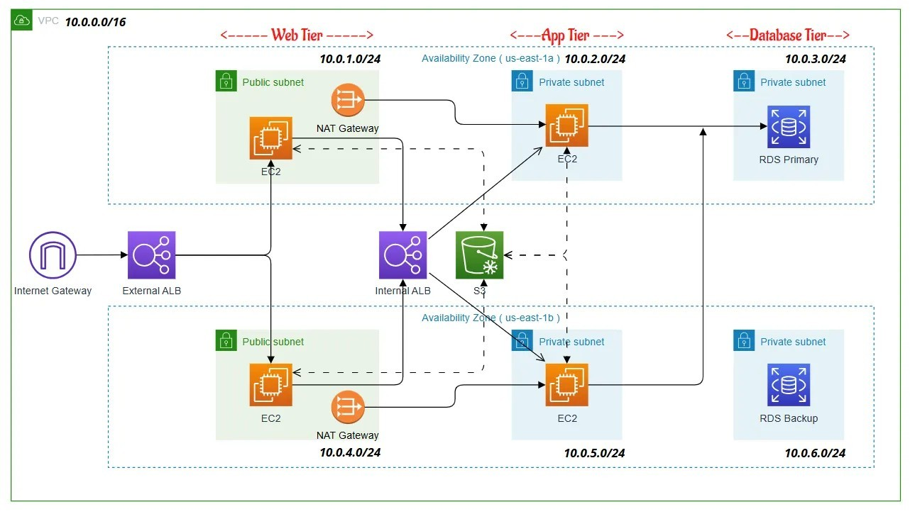
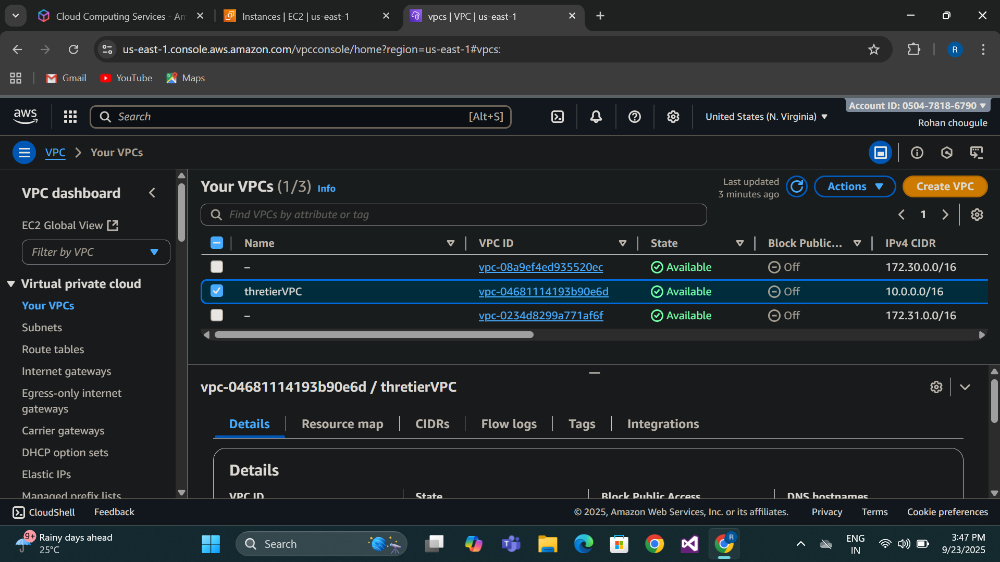
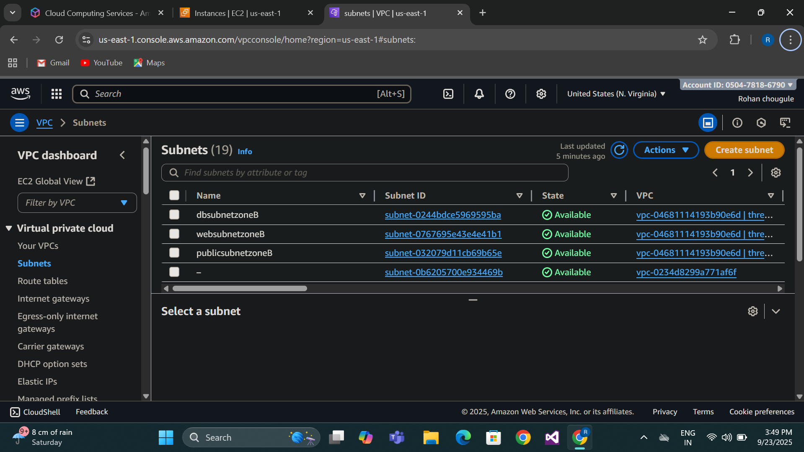
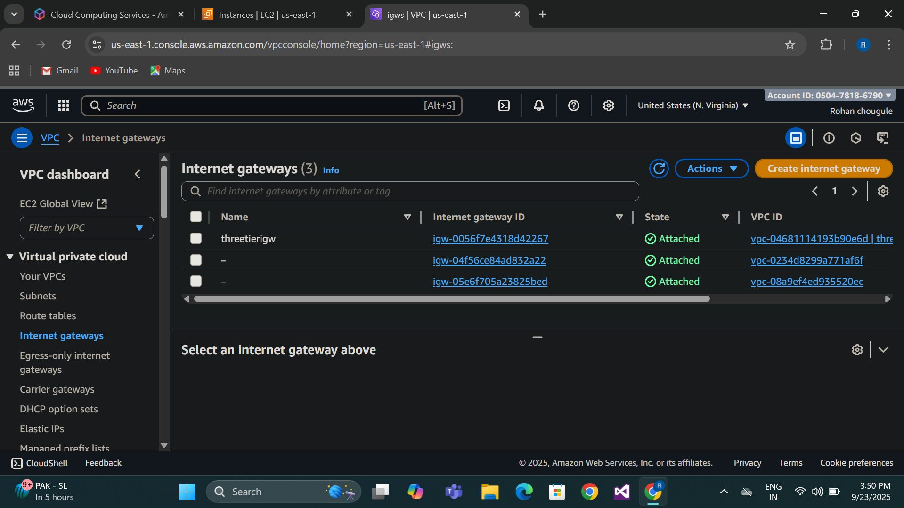
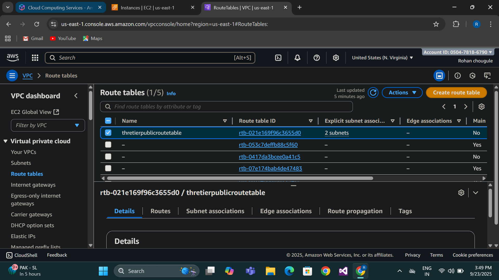
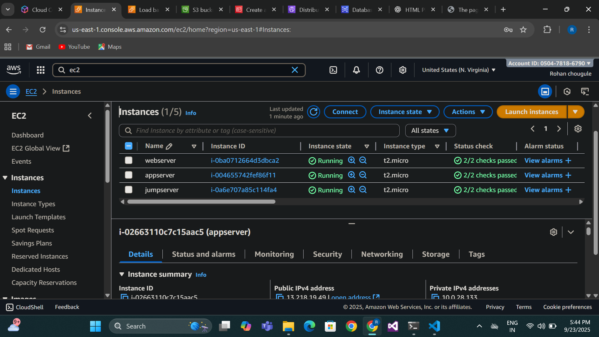
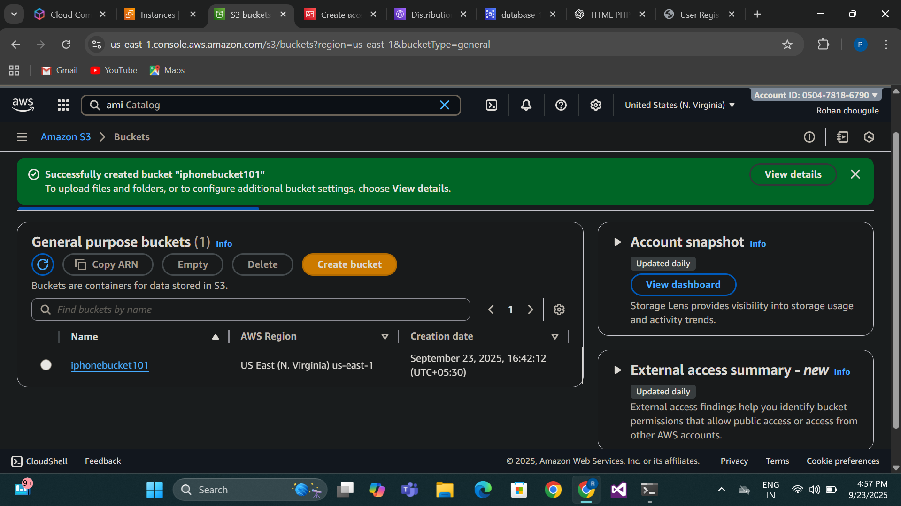
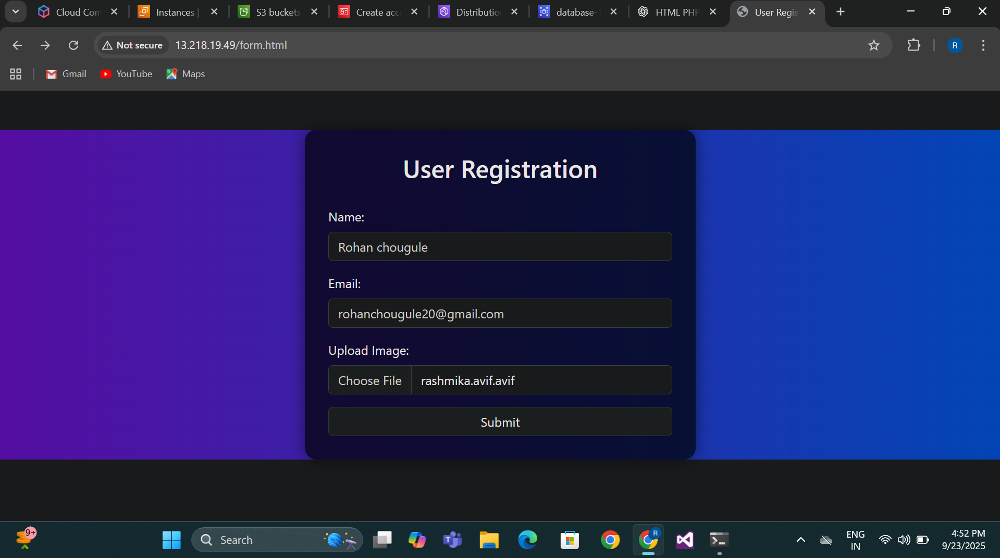
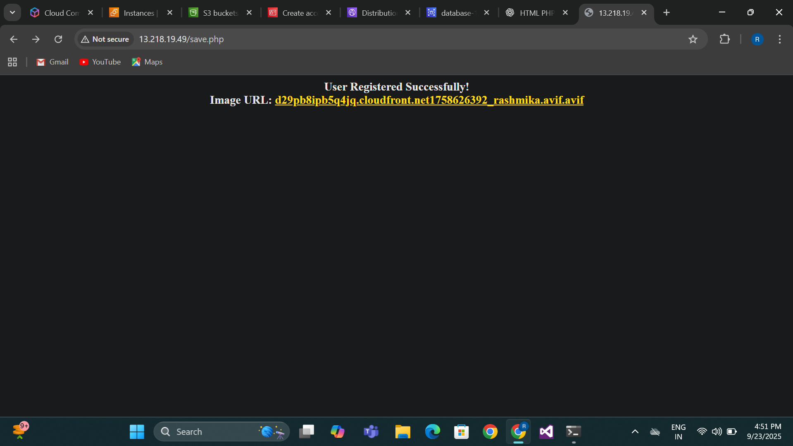

# 3-Tier Architecture AWS
## 📌Introduction
This project is developed using a Three-Tier Architecture, dividing the system into Presentation, Application, and Data tiers.
The presentation tier handles the user interface, while the application tier manages the business logic and processing.
The data tier stores and secures all the application information in a database.
This architecture improves scalability, security, and maintainability of the system.

## 1. Architecture Overview

The three-tier architecture separates concerns into distinct layers:

* **Web Tier:** Handles HTTP requests, serves static content, and routes dynamic requests to the application tier     
* **Application Tier:** Processes business logic and communicates with the database tier   
* **Database Tier:** Manages data storage and retrieval using MySQL
<!DOCTYPE html>
<html>
<head>
    <title>3-Tier Architecture</title>
</head>
<body>
    <h2>3-Tier Architecture</h2>
    <table border="1" cellpadding="8" cellspacing="0">
        <tr>
            <th>🏷️ Tier</th>
            <th>🎯 Purpose</th>
            <th>🌐 Subnet Type</th>
            <th>📝 Language / Stack</th>
            <th>⚙️ EC2 / Role</th>
        </tr>
        <tr>
            <td>Tier 1</td>
            <td>🌍 Frontend (UI)</td>
            <td>🟢 Public Subnet</td>
            <td>HTML, CSS, JS, NGINX</td>
            <td>Handles browser requests</td>
        </tr>
        <tr>
            <td>Tier 2</td>
            <td>🖥️ Application Logic</td>
            <td>🔒 Private Subnet</td>
            <td>PHP, NGINX</td>
            <td>Executes business logic</td>
        </tr>
        <tr>
            <td>Tier 3</td>
            <td>💾 Database Storage</td>
            <td>🔒 Private Subnet</td>
            <td>MySQL Database</td>
            <td>Stores persistent data</td>
        </tr>
    </table>
</body>
</html>

## 2. VPC & Subnet Setup
### 2.1 Create a VPC
* **Name:** 3-Tier Architecture-VPC      
* **CIDR block:** 10.0.0.0/16  
* **DNS Hostnames:** Enabled

## 2.2 Create Subnets
<!DOCTYPE html>
<html>
<head>
    <title>Subnets Table</title>
</head>
<body>
    <h2>Subnets</h2>
    <table border="1" cellpadding="8" cellspacing="0">
        <tr>
            <th>📝 Subnet Name</th>
            <th>🌍 CIDR Block</th>
            <th>🗺️ Availability Zone (AZ)</th>
            <th>🔐 Type</th>
        </tr>
        <tr>
            <td>Public-Subnet</td>
            <td>10.0.16.0/24</td>
            <td>us-east-1</td>
            <td>🌐 Public</td>
        </tr>
        <tr>
            <td>Private-App</td>
            <td>10.0.32.0/24</td>
            <td>us-east-1</td>
            <td>🔒 Private</td>
        </tr>
        <tr>
            <td>Private-DB</td>
            <td>10.0.48.0/24</td>
            <td>us-east-1</td>
            <td>🔒 Private</td>
        </tr>
        <tr>
            <td>Private-DB-2</td>
            <td>10.0.64.0/24</td>
            <td>us-east-1</td>
            <td>🔒 Private</td>
        </tr>
    </table>
</body>
</html>

Enable Auto-Assign Public IP for Public Subnet.

## 2.3 Create Internet Gateway
* **Name**: thre-Tier Architecture-Gateway  
* **Attach** to thre-Tier Architecture-vpc

## 2.4 Create Route Tables

#### a. Public Route Table
* **Name:** Thre-tier
* **Associate with:** Public-Subnet
* **Add Route:**  
0.0.0.0/0 ➜ Internet Gateway

#### b. Private Route Table
* **Name:** Thre-Tier
* **Associate with:** Private-App, Private-DB
* No external route initially.

## 🌐 3. NAT Gateway Setup
 **❓ Why NAT ?**   

Private subnets need NAT to access the internet for updates/installations.

**Steps**    
1.Allocate Elastic IP   
2.Create NAT Gateway  
* **Subnet:** Public-Subnet   
* **Elastic IP:** Use the one created above
* **Name:** SpringBoot-NATGW          

3.Update Private Route Table
* Add Route:
* 0.0.0.0/0 ➜ NAT Gateway
## 4.Web Tier Components
The web tier consists of:

* Auto-scaling group of EC2 instances running web servers
* Internet-facing Application Load Balancer
* Custom AMI for consistent deployment

## 5.Application Tier Components
The application tier includes:

* Internal Application Load Balancer
* Auto-scaling group of application servers
* Custom AMI with application code

## 6.Database Tier
The database tier uses Amazon RDS with MySQL :
* Launched an RDS MySQL instance (database-1) in private subnets
* Configured security groups to allow access only from the application tier
* Set up the database connection string for application use

## 7.Content Delivery and Storage
For performance and scalability, we implemented:
* CloudFront distribution for content delivery
* S3 buckets for image storage

## 8.Security Groups 
Security Groups act as virtual firewalls to control inbound and outbound traffic for each tier.
Below is the configuration for Web, App, and Database layers.

<!DOCTYPE html>
<html>
 <head>
    <title>Security Groups Table</title>
</head>
<body>
    <h2>Security Groups configuration</h2>
    <table border="1" cellpadding="8" cellspacing="0">
        <tr>
            <th>SG Name</th>
            <th>Attached To</th>
            <th>Inbound Rules</th>
            <th>Outbound</th>
        </tr>
        <tr>
            <td>Tomcat-SG</td>
            <td>Frontend EC2</td>
            <td>22 (My IP), 8080 (Anywhere)</td>
            <td>All traffic</td>
        </tr>
        <tr>
            <td>App-SG</td>
            <td>Backend EC2</td>
            <td>22 (My IP), 8081 (From Tomcat-SG)</td>
            <td>All traffic</td>
        </tr>
        <tr>
            <td>DB-SG</td>
            <td>DB EC2</td>
            <td>5432 (From App-SG), 22 (From Bastion if needed)</td>
            <td>All traffic</td>
        </tr>
    </table>
</body>
</html>

## Security Considerations
* Database instances are in private subnets with no public access
* Application tier is behind an internal load balancer
* Security groups restrict traffic between tiers
* NAT Gateway provides controlled outbound internet access
## 9.Performance Features
* Auto-scaling groups ensure capacity meets demand
* Load balancers distribute traffic evenly
* CloudFront provides global content delivery
* Multi-AZ deployment ensures high availability
## 10.Usage
The application supports image uploads which are:

* Stored in S3 buckets for durability
* Metadata is saved in the MySQL database
* Distributed via CloudFront for fast global access
## 11.Monitoring
All components are configured with appropriate monitoring and logging to ensure operational visibility and quick troubleshooting.

## 12.Conclusion
This three-tier architecture on AWS provides a scalable, secure, and highly available foundation for web applications, following AWS best practices for cloud infrastructure.

